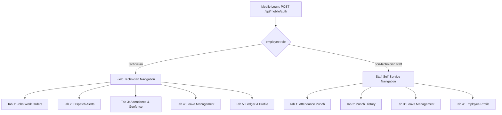

# MOBILE DESIGN — UI/UX System for Workman Field Companion (v1)

> **Platform Target**: React Native (Expo SDK 52+, Expo Router v4) with NativeWind (Tailwind CSS v3)  
> **Target Devices**: Android (API 26+) & iOS (16.0+)  
> **Visual Identity**: Clean, Modern Light Theme — Perfectly synchronized with the Workman Services ERP Light Theme Palette (`#F8FAFC` foundation, `#FFFFFF` crisp cards, Emerald `#0D7A5F` accents, and subtle hairline borders).

---

## 1. Executive Summary & Design Philosophy

The **Workman Field Companion** app is engineered specifically for field technicians and staff members, adopting the **exact visual language, light palette, and high-density design system** of the Workman Services ERP web console.

### Core Design Principles

1. **ERP Unified Light Theme (`#F8FAFC` & `#FFFFFF`)**:
   - The interface features a clean, airy, professional off-white background foundation (`#F8FAFC` / `#F7F7F8`) with pure white card surfaces (`#FFFFFF`).
   - Clean structural hairlines (`#E2E8F0` / `#E4E4E7`) replace heavy shadows, creating a calm, high-density workspace that mirrors the web ERP.
2. **High-Contrast Sunlight & Glare Legibility**:
   - High-contrast typography (`#0F172A` / `#18181B` deep slate) on crisp white backgrounds delivers superior outdoor readability under direct 45°C+ sunlight glare without requiring harsh black surfaces.
   - Tinted status pills (`emerald-50`, `amber-50`, `rose-50`, `blue-50`) provide immediate recognition without visual fatigue.
3. **Thumb-Zone & Single-Hand Usability**:
   - All critical, time-sensitive actions (Accept Job, Start Work, Biometric Punch, Complete Work) are docked in the lower 40% of the screen.
   - Large touch targets (56dp primary buttons) ensure seamless operation with gloved or wet hands.
4. **Multi-Sensory Alerts (Audio + Heavy Haptics)**:
   - Loud audible dispatch sirens and distinct haptic patterns guarantee technicians never miss an emergency work order in noisy mechanical plant rooms.
5. **Zero Data Loss / Offline-First**:
   - Local SQLite / WatermelonDB storage caches all work orders and punch attempts. Visual offline banners (`bg-amber-50 text-amber-900 border-amber-200`) alert users during cellular dropouts without halting workflow.

---

## 2. Design Tokens & Color Architecture (Light Theme)

```
┌─────────────────────────────────────────────────────────────┐
│                   CANONICAL LIGHT PALETTE                   │
├─────────────────┬───────────┬───────────────────────────────┤
│ Token           │ Hex Code  │ Usage                         │
├─────────────────┼───────────┼───────────────────────────────┤
│ bg-app          │ #F8FAFC   │ Main app backdrop foundation  │
│ bg-card         │ #FFFFFF   │ Cards, modal surfaces, sheets │
│ bg-subtle       │ #F1F5F9   │ Input backgrounds, row hover  │
│ bg-muted        │ #E2E8F0   │ Chip bases, inactive states   │
│ border-light    │ #E2E8F0   │ Clean hairline card borders   │
│ border-focus    │ #0D7A5F   │ Active focus ring & borders   │
├─────────────────┼───────────┼───────────────────────────────┤
│ brand-primary   │ #0D7A5F   │ Workman Emerald (Primary CTA) │
│ brand-hover     │ #0A624C   │ Pressed / active button state │
│ brand-light     │ #ECFDF5   │ Emerald pill & badge tint     │
│ brand-accent    │ #10B981   │ Bright success indicators     │
├─────────────────┼───────────┼───────────────────────────────┤
│ status-amber-bg │ #FFFBEB   │ Pending / Timer badge back    │
│ status-amber-fg │ #B45309   │ Amber badge text & icons      │
│ status-amber-br │ #FDE68A   │ Amber border stroke           │
├─────────────────┼───────────┼───────────────────────────────┤
│ status-rose-bg  │ #FEF2F2   │ Emergency / Danger badge back │
│ status-rose-fg  │ #B91C1C   │ Red badge text & alerts       │
│ status-rose-br  │ #FECACA   │ Red border stroke             │
├─────────────────┼───────────┼───────────────────────────────┤
│ status-blue-bg  │ #EFF6FF   │ Telemetry / Transit badge back│
│ status-blue-fg  │ #1D4ED8   │ Blue badge text & GPS icons   │
│ status-blue-br  │ #BFDBFE   │ Blue border stroke            │
├─────────────────┼───────────┼───────────────────────────────┤
│ text-primary    │ #0F172A   │ Headings, body, primary data  │
│ text-secondary  │ #475569   │ Field labels, supporting info │
│ text-muted      │ #94A3B8   │ Placeholders, timestamps      │
└─────────────────┴───────────┴───────────────────────────────┘
```

### Typography Scale
- **Font Family**: System Sans (SF Pro Text/Display on iOS, Inter / Roboto on Android).
- **Monospace Font**: System Monospace (SF Mono / Roboto Mono) for all Job Numbers (`JOB-2026-0042`), GPS Coordinates, Currency (`PKR 14,500`), and Countdown Timers.
- **Sizes & Weights**:
  - `Hero / Metric`: 28–32pt, Bold (700), Monospace or Display (`text-[#0F172A]`).
  - `Screen Title`: 20–22pt, Semi-Bold (600), Clean slate.
  - `Section Header`: 13–14pt, Semi-Bold (600), Uppercase tracking (`tracking-wider text-[#64748B]`).
  - `Body / Values`: 14–15pt, Regular (400) or Semi-Bold (600) (`text-[#0F172A]`).
  - `Meta / Captions`: 11–12pt, Medium (500), Muted (`text-[#64748B]`).

### Spatial Hierarchy & Touch Targets
- **Interactive Touch Target**: Minimum 48 x 48 dp (accessible for gloved fingers).
- **Primary CTA Height**: 56 dp full-width button with `rounded-xl` (12 dp) and bold white text on emerald `#0D7A5F`.
- **Card Surfaces**:
  - Background: `bg-white`
  - Border: `border border-[#E2E8F0]`
  - Shadow: `shadow-xs` / `shadow-sm` (subtle, clean elevation)
  - Padding: `p-4` (16 dp)
- **Modals & Drawers**:
  - Backdrop: `bg-black/30 backdrop-blur-xs`
  - Container: Pure white with `rounded-t-2xl` (16–20 dp)

---

## 3. Dual-Persona Role Navigation

The mobile app's bottom tab navigation bar dynamically adapts to the logged-in employee's `role` returned by `POST /api/mobile/auth`.



### Navigation Rules
1. **Field Technician Mode (`role === "technician"`)**:
   - Focuses on real-time task dispatch, material consumption, work order progression, and client payments.
   - Dynamic badges highlight pending job dispatches and active emergency alerts.
2. **Staff Mode (`role !== "technician"`)**:
   - For office employees, accountants, dispatchers, and drivers.
   - Hides all job queues, equipment checklists, warehouse inventory requests, and customer dispatches.
   - Centers on geofenced attendance, check-in history, and leave applications.

---

## 4. Screen-by-Screen Component Specifications (Light Theme)

### Screen 1: Mobile Authentication (`app/(auth)/login.tsx`)
- **Visuals**:
  - Crisp light foundation (`#F8FAFC`).
  - Centered Workman Services shield logo in deep emerald `#0D7A5F` with subtle green glow.
  - White input cards (`bg-white border border-[#E2E8F0] shadow-xs rounded-xl`).
  - Phone input with country prefix pill (`+92`) and clean typography.
  - 6-digit PIN input with masked dots and clear focus ring (`focus:border-[#0D7A5F]`).
  - Biometric quick-action button (`Face ID` / `Fingerprint`) with emerald icon.
  - Primary button: Solid Emerald `#0D7A5F` (`[ Login to Field Companion ]`, 56dp height).
- **Error States**:
  - Light rose alert card (`bg-rose-50 text-rose-800 border border-rose-200 rounded-lg p-3 text-xs`).

---

### Screen 2: Real-Time Dispatch Emergency Alert Modal (`components/dispatch/DispatchAlertModal.tsx`)
- **Trigger**: Incoming Server-Sent Events (SSE) `NEW_APP_REQUEST` or Push Notification.
- **Anatomy**:
  - Modal container: Crisp white floating card with soft rounded corners (`rounded-2xl shadow-xl border border-[#E2E8F0]`).
  - **Pulsing Radial Countdown**: Circular timer ring showing 60-second countdown in vivid amber (`#F59E0B`).
  - **Priority Pill**: `bg-rose-50 text-rose-700 border border-rose-200 font-bold text-xs uppercase px-2.5 py-1 rounded-full`.
  - **Job Title & Issue**: Deep slate `#0F172A` bold heading with clear fault summary.
  - **Customer & Transit Card**:
    - Light slate surface (`bg-[#F8FAFC] border border-[#E2E8F0] p-3.5 rounded-xl`).
    - Customer Name, Building, Floor/Unit.
    - Distance pill: `bg-blue-50 text-blue-700 border border-blue-200 font-mono text-xs px-2 py-0.5 rounded-full` (e.g. `2.4 km away • 8 mins`).
  - **Actions (Thumb Zone)**:
    - Primary Button: `[ Accept Job & Navigate ]` (`bg-[#0D7A5F] text-white font-bold text-sm h-14 rounded-xl shadow-xs`).
    - Secondary Button: `[ Decline Request ]` (`bg-[#F1F5F9] text-[#475569] font-semibold text-xs h-11 rounded-lg mt-2`).
- **Feedback**: Repetitive heavy haptic vibrations and dispatch alarm audio chime.

---

### Screen 3: Active Job Execution & Workflow (`app/(tabs)/jobs/[id].tsx`)

This is the technician's primary workspace during an ongoing service call.

```
┌─────────────────────────────────────────────────────────────┐
│ ← Job #JOB-2026-0042                    [ Call Customer 📞 ]│
├─────────────────────────────────────────────────────────────┤
│ CUSTOMER CARD (White Card • Light Slate Foundation)         │
│ Al-Baraka Commercial Tower (Floor 4, Server Room)           │
│ Contact: Engr. Tariq Farooq • 0300-8451122                  │
├─────────────────────────────────────────────────────────────┤
│ STATUS STEPPER (Emerald Progress Bar)                       │
│ [✓ Assigned] ── [✓ En Route] ── [▶ In Progress] ── [ Done ] │
├─────────────────────────────────────────────────────────────┤
│ REQUIRED SCOPE & DIAGNOSIS                                  │
│ [✓] Inspect VRF Indoor Unit suction pressure                │
│ [ ] Replace 45uF Blower Fan Dual-Run Capacitor              │
│ [ ] Clean primary condensate drain trap                     │
├─────────────────────────────────────────────────────────────┤
│ PARTS & INVENTORY CONSUMED (White Card • Hairline Border)   │
│ • R410A Refrigerant (1.5 kg)                    PKR 4,500   │
│ • 45uF Fan Capacitor (Qty: 1)                   PKR 1,800   │
│ [+ Request Warehouse Parts]   [+ Request Customer Discount] │
├─────────────────────────────────────────────────────────────┤
│ FIELD EXPENSES LOGGED (PETTY CASH)                          │
│ • Brass Flare Nut 3/8" (Local hardware receipt)  PKR 450    │
│ [+ Snap Receipt Photo]                                      │
├─────────────────────────────────────────────────────────────┤
│ BOTTOM FIXED ACTION BAR (Crisp White Floating Bar)          │
│ [ PAUSE JOB ]               [ COMPLETE & COLLECT CASH (PKR) ]│
└─────────────────────────────────────────────────────────────┘
```

#### Micro-Interactions
1. **Checklist Items**: Clean white cards with checkbox rings. Checking off turns the item emerald with strike-through text.
2. **Item Quantity Steppers**: `[-]` and `[+]` buttons on soft neutral pills (`bg-[#F1F5F9]`) for adjusting actual quantities used.
3. **Field Discount Sheet**: Slide-up modal to enter discount amount and reason, instantly updating net totals.
4. **Completion Modal**:
   - Textarea for technician remarks.
   - Payment method pill selector: `Cash` (shows exact PKR balance), `Bank Transfer`, `Cheque`, or `Unmarked`.
   - Big emerald button: `[ Finalize & Submit Work Order ]`.

---

### Screen 4: Geofenced Dual-Gate Attendance Punch (`app/(tabs)/attendance.tsx`)

Combines GPS geofence radar verification with facial biometric enrollment stub.

- **Geofence Radar Visual**:
  - Soft off-white radar card (`bg-white border border-[#E2E8F0] rounded-2xl p-4`).
  - Animated pulsing emerald circle indicating live GPS accuracy (e.g. `GPS Accuracy: ±3.2m`).
  - Distance indicator:
    - **Inside Geofence**: `bg-emerald-50 text-emerald-800 border border-emerald-200 font-bold px-3 py-1 rounded-full text-xs`.
      `● INSIDE GEOFENCE (18m from Gulberg Depot • Max: 300m)`
    - **Outside Geofence**: `bg-amber-50 text-amber-800 border border-amber-200 font-bold px-3 py-1 rounded-full text-xs`.
      `▲ OUTSIDE GEOFENCE (1.4 km from Depot • Will be Flagged)`
- **Biometric Camera Viewfinder**:
  - Centered circular camera viewport with clean emerald alignment ring.
  - Guide text: "Align face inside circle".
- **Check-in / Check-out Segmented Switcher**:
  - Clean light pill switcher (`bg-[#F1F5F9] p-1 rounded-xl`):
    - `Check In (Shift Start)` vs `Check Out (Shift End)`.
- **Punch Button (Thumb Zone)**:
  - Solid Emerald `#0D7A5F` CTA (`h-14 rounded-xl font-bold text-white shadow-sm`):
    `[ RECORD BIOMETRIC ATTENDANCE ]`
- **Server Verification Feedback Card**:
  - Displays instant server status badge:
    - `ACCEPTED`: Emerald pill (`bg-emerald-50 text-emerald-800 border-emerald-200`).
    - `ACCEPTED-BUT-FLAGGED`: Amber pill (`bg-amber-50 text-amber-800 border-amber-200`) showing flag reason (speed jump or outside radius).
    - `REJECTED`: Rose pill (`bg-rose-50 text-rose-800 border-rose-200`) for stale timestamp.

---

### Screen 5: Staff & Technician Leave Portal (`app/(tabs)/leaves.tsx`)

- **Top Balance Cards (3-Column Grid)**:
  - **Annual Leave**: White card, `Allocated: 14 • Used: 4`, large bold **`10 Remaining`** in Emerald `#0D7A5F`.
  - **Casual Leave**: White card, `Allocated: 10 • Used: 2`, large bold **`8 Remaining`** in Blue `#1D4ED8`.
  - **Sick Leave**: White card, `Allocated: 8 • Used: 1`, large bold **`7 Remaining`** in Amber `#B45309`.
- **Upcoming Gazetted Holidays Carousel**:
  - Horizontal scrolling cards (`bg-white border border-[#E2E8F0] p-3 rounded-xl`):
    - Holiday name (e.g. "Pakistan Day"), calendar date, and "in X days" badge.
- **Leave History List**:
  - White list items showing leave type, date range, total days, and status badge:
    - `Pending`: Amber pill (`bg-amber-50 text-amber-800 border-amber-200`).
    - `Approved`: Emerald pill (`bg-emerald-50 text-emerald-800 border-emerald-200`).
    - `Rejected`: Rose pill (`bg-rose-50 text-rose-800 border-rose-200`).
- **Floating Action Button**:
  - Bottom-right emerald button `[ + Apply Leave ]` opening a slide-up application sheet.

---

### Screen 6: Technician Ledger & Profile (`app/(tabs)/profile.tsx`)

- **Netted Hisaab Financial Card**:
  - Pure white card with soft shadow:
    - Main Metric: **Net Hisaab Balance** (`PKR 8,450` in bold `#0F172A`).
    - Sub-row 1: Cash in Hand (collected from customers).
    - Sub-row 2: Pending Field Expense Reimbursements.
    - Sub-row 3: Active Salary Advances.
- **Hardware & Telemetry Diagnostics Card**:
  - Push notification status: `ExponentPushToken Active ✓` in emerald.
  - Background GPS telemetry status: `Location Broadcast: Active (every 30s)`.
  - Biometric face enrollment status: `Face ID Enrolled ✓`.
- **Emergency Hotline Button**:
  - Quick dialer button to Dispatch Desk (`042-35789000`).

---

## 5. Offline Resiliency & Data Synchronization

1. **Local State Store (Zustand + AsyncStorage)**:
   - All assigned jobs, equipment history, and leave balances are cached locally upon fetch.
   - When offline, technicians can view job instructions, customer addresses, and equipment histories without cellular reception.
2. **Mutation Queue Pattern**:
   - Actions taken offline (`Start Job`, `Add Part`, `Log Expense`, `Punch Attendance`) update local UI state immediately with an amber sync badge (`Sync Pending ⟳`).
   - Mutations are serialized in local SQLite storage.
3. **Background Flush**:
   - The app monitors connection state with NetInfo and flushes the queue sequentially with idempotency keys upon cellular recovery.
4. **Clock-Tampering Guard**:
   - The app verifies client timestamp against ERP server time upon every heartbeat ping to prevent mobile system clock manipulation.

---

## 6. Motion, Haptics & Sensory Design

| User Action | Visual Animation | Haptic Feedback | Audio Cue |
| :--- | :--- | :--- | :--- |
| **New Job Dispatch Received** | Amber/rose alert pulse | Repetitive Heavy Impact (`Haptics.notificationAsync(Warning)`) | Emergency Siren / Dispatch Bell |
| **Accept Job** | Emerald swipe transition | Medium Impact (`Haptics.impactAsync(Medium)`) | Confirmation Chime |
| **Punch Attendance** | Green radar ripple | Success Notification (`Haptics.notificationAsync(Success)`) | Camera Shutter Click |
| **Geofence Warning** | Amber border glow | Double Light Buzz | Soft Warning Ding |
| **Complete Job** | Checkmark scale-up | Heavy Impact (`Haptics.impactAsync(Heavy)`) | Success Chord |

---

## 7. Accessibility & Field Usability Standards

1. **Sunlight Readability**:
   - Deep slate text (`#0F172A`) on crisp white backgrounds delivers a contrast ratio exceeding **14:1**, far exceeding WCAG AAA requirements.
2. **Multi-Sensory Status Badges**:
   - Every status chip pairs a distinct color with a descriptive icon and text label (never relying on color alone for colorblind operators).
3. **Voice-to-Text Input**:
   - All freeform text fields (Job Remarks, Expense Notes, Leave Reasons) include native microphone dictation buttons so technicians can speak notes with dirty hands.
4. **Oversized Numeric Pads**:
   - Decimal and currency inputs use oversized numeric pads (`h-14` buttons) preventing mistyped customer billing amounts.
