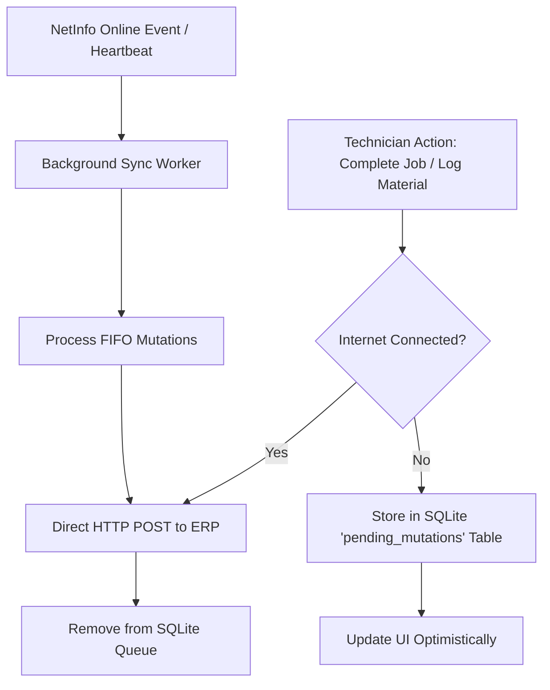

# WORKMAN SERVICES — MOBILE EMPLOYEE & TECHNICIAN COMPANION APPLICATION
## Master Generation Prompt & Architectural Blueprint (iOS & Android)

> **Purpose**: Use this prompt to autonomously scaffold, code, and deploy the native cross-platform mobile companion application for **WORKMAN SERVICES**. This application communicates directly with the **WORKMAN SERVICES ERP backend** (`http://localhost:3001` or production URL) and runs natively on both **iOS** and **Android**.  
> **UI/UX Design Specification**: See [05-MOBILE-DESIGN.md](file:///d:/WORKMAN%20SERVICES/05-MOBILE-DESIGN.md) for the complete Dark OLED design tokens, thumb ergonomics, layout blueprints, and haptic specifications.

---

## 1. System Overview & Dual-Persona Architecture

The **Workman Services Mobile Companion** is a unified, intelligent mobile application with **Role-Based Dynamic Persona Switching** based on the logged-in user's `employee.role`:

### Persona A: Field Technician (`role === "technician"`)
Full mission-critical field operations suite:
1. **Real-time Task & Dispatch Requests**: Instant native push notifications (APNs / FCM) sent by ERP dispatchers with 1-tap "Accept Job" or "Acknowledge Alert" actions.
2. **Offline-First Field Work Orders**: Full job lifecycle execution (`Assigned` ➔ `Accepted` ➔ `InProgress` ➔ `Paused` ➔ `CompletedPendingVerification`) with local SQLite caching.
3. **Itemized Material & Actual Usage Logging**: Mandatory quantity tracking for every planned job item, unused material return logging, and field discount requests sent to accountants.
4. **Automated Background GPS Telemetry**: Periodic high-efficiency location pings enabling dispatchers to track fleet proximity in real time on the ERP Live Map.
5. **Expense & Receipt Camera Scanner**: On-site out-of-pocket expense claims with camera receipt upload.
6. **Geofenced Biometric Attendance**: Camera-based selfie check-in with GPS validation against customer job site or office geofence zones.
7. **Complete Employee Self-Service (ESS) & Leaves**: Leave management portal (apply leave, view leave balances, approval history), hisaab ledger (advances vs settled balances), payslips, and assigned tools audit.

### Persona B: General / Non-Technician Employee (`role !== "technician"`)
*(Office Staff, Dispatchers, Accountants, HR, Storekeepers, Management, Drivers, Helpers)*
A streamlined, distraction-free **Staff Self-Service & HR Portal**:
1. **Zero Field Clutter**: Completely hides the Job dispatch queues, active work orders, material tracking, and field tool audit screens.
2. **Geofenced Biometric Attendance**: Daily selfie attendance check-in/check-out validated against designated office, warehouse, or facility geofence zones.
3. **Comprehensive Leave Management Portal**: Real-time leave balance breakdown (Annual, Casual, Sick, Unpaid), leave application with date picker and reason, live request approval status tracking, and company holiday calendar.
4. **Staff Profile & Payslips**: View personal employment profile, reporting manager, emergency contact, and monthly payslips.

---

## 2. Recommended Tech Stack

| Layer | Selected Technology | Rationale |
| :--- | :--- | :--- |
| **Framework** | **React Native with Expo SDK 51+** (New Architecture & Hermes) | Single TypeScript codebase with 100% native performance on iOS & Android. Effortless build and OTA updates via Expo Application Services (EAS). |
| **Routing** | **Expo Router v3** | File-based, deeply typed navigation matching Next.js App Router conventions. Supports deep-linking from push notifications directly into job cards. |
| **Styling** | **NativeWind v4** (Tailwind CSS for React Native) | Shares identical color tokens, spacing, and typography classes (`#0D7A5F`, `#18181B`, emerald accents) with the web ERP. |
| **State & Data Fetching** | **TanStack Query v5** + **Zustand** | Automatic background revalidation, optimistic cache mutations, offline caching, and clean global auth/device state. |
| **Offline Storage** | **Expo SQLite** (`expo-sqlite/next`) | High-performance local relational database storing jobs, line items, and an offline mutation queue that auto-syncs upon reconnection. |
| **Push Notifications** | **`expo-notifications`** | Handles native APNs (iOS) and FCM (Android) push channels, badge counters, and background notification responses via Expo Push API. |
| **Hardware & Sensors** | **`expo-location`**, **`expo-camera`**, **`expo-local-authentication`** | Turn-key native APIs for background GPS tracking, camera receipt/job photos, and FaceID / TouchID biometric login. |
| **Mapping & Routing** | **`react-native-maps`** | Native vector maps with technician and customer pins, polyline routes, and deep links to Apple Maps & Google Maps navigation. |

---

## 3. Application Directory Structure

```text
workman-companion-mobile/
├── app/                                # Expo Router file-based screens
│   ├── _layout.tsx                     # Root provider (QueryClient, Auth, Notifications, OfflineSync)
│   ├── (auth)/
│   │   ├── login.tsx                   # Phone & passcode login + Biometric FaceID unlock
│   │   └── switch-tenant.tsx           # Environment / server URL selector (Dev / Prod)
│   ├── (tabs)/
│   │   ├── _layout.tsx                 # Dynamic Role-Adaptive Tab Bar (Technician vs Other Staff)
│   │   ├── index.tsx                   # [Technician Only] Active schedule & assigned jobs list
│   │   ├── requests.tsx                # [Technician Only] Live Dispatch Requests & Priority Alerts Inbox
│   │   ├── attendance.tsx              # [All Employees] Geofenced Face & GPS Attendance Check-In / Out
│   │   ├── leaves.tsx                  # [All Employees] Dedicated Leave Management Portal (Balances & History)
│   │   └── profile.tsx                 # [All Employees] Profile, Payslips, Tools & Hisaab (Role-tailored)
│   ├── leaves/
│   │   ├── apply.tsx                   # Apply for Leave Modal (Date pickers, type, reason)
│   │   └── [id].tsx                    # Leave request detail & approval timeline
│   ├── jobs/                           # [Technician Only]
│   │   ├── [id].tsx                    # Comprehensive Job Detail & Execution Workspace
│   │   ├── pause-modal.tsx             # Partial completion & pause modal (units done vs remaining)
│   │   ├── complete-modal.tsx          # Completion modal with mandatory actual item quantities
│   │   └── discount-modal.tsx          # Field item discount request to accountant
│   └── expenses/                       # [Technician Only]
│       └── new.tsx                     # Camera expense claim & receipt scanner
├── components/
│   ├── ui/
│   │   ├── StatusBadge.tsx             # Status badges (Job, Request, Leave status)
│   │   ├── Card.tsx                    # Styled container card
│   │   ├── Button.tsx                  # Standard primary (#0D7A5F) & secondary buttons
│   │   └── OfflineNotice.tsx           # Floating banner when network is disconnected
│   ├── leaves/
│   │   ├── LeaveBalanceCard.tsx        # Balances widget (Annual, Casual, Sick, Unpaid)
│   │   ├── LeaveRequestCard.tsx        # Application card with approval status badge & dates
│   │   └── LeaveCalendar.tsx           # Monthly holiday & approved leave calendar
│   ├── attendance/
│   │   ├── GeofenceMapCard.tsx         # Proximity distance indicator to office or job site
│   │   └── PunchLogList.tsx            # Daily check-in / check-out history list
│   ├── job/                            # [Technician Only]
│   │   ├── JobCard.tsx                 # Work order item card with status, time & customer
│   │   ├── JobItemList.tsx             # Itemized materials & actual quantity inputs
│   │   └── JobActionToolbar.tsx        # Bottom floating execution actions (Start/Pause/Complete)
│   └── requests/                       # [Technician Only]
│       └── RequestCard.tsx             # Interactive card with "Accept" / "Decline" actions
├── services/
│   ├── api.ts                          # Axios / Fetch client with JWT & offline queue interceptors
│   ├── authService.ts                  # Login, profile fetch, and role hydration
│   ├── leavesService.ts                # Leave balances fetching & leave request submissions
│   ├── attendanceService.ts            # Geofenced check-in/out and attendance logs
│   ├── jobsService.ts                  # [Technician Only] Job status transitions & item updates
│   ├── requestsService.ts              # [Technician Only] Dispatch requests fetching & responses
│   ├── pushNotificationService.ts      # Push token registration & listener setup
│   ├── telemetryService.ts             # [Technician Only] Background location tracking
│   └── syncService.ts                  # SQLite offline mutation synchronization engine
├── db/
│   ├── schema.ts                       # SQLite table definitions (jobs, items, requests, mutations)
│   └── database.ts                     # Database initialization and migration helpers
├── store/
│   ├── authStore.ts                    # Zustand store: user session, active employee & employee.role
│   └── syncStore.ts                    # Zustand store for offline mutation queue status
├── hooks/
│   ├── useNetworkStatus.ts             # Network connectivity hook (NetInfo)
│   └── useLiveRequestsStream.ts        # Server-Sent Events (SSE) live connection hook
├── tailwind.config.js                  # NativeWind configuration
├── app.json                            # Expo app manifest with native permissions
└── package.json
```

---

## 4. Backend REST API Integration Contracts & Endpoint Directory

> **ERP Base URL**: `http://<ERP_HOST>:3001` (Dev/Local) or `https://erp.workmanservices.pk` (Production).  
> All endpoints expect and return standard JSON headers (`Content-Type: application/json`). Authenticated requests send `Authorization: Bearer <token>`.

### Complete ERP Endpoint Directory (Quick Reference)

| Category | Method | Path | Direction | Description |
| :--- | :--- | :--- | :--- | :--- |
| **Auth** | `POST` | `/api/mobile/auth` | Mobile &rarr; ERP | Login with phone / email / employeeId + PIN; returns JWT token & employee profile |
| **Auth** | `GET` | `/api/mobile/auth?employeeId={id}` | Mobile &larr; ERP | Hydrate user profile, leave balances, recent attendance, and role status |
| **Biometrics** | `POST` | `/api/employees/{id}/enrollment` | Mobile &rarr; ERP | Store 512-dim facial embedding from on-device enrollment / re-enrollment |
| **Biometrics** | `GET` | `/api/employees/{id}/enrollment` | Mobile &larr; ERP | Fetch face enrollment status, timestamp, and re-enrollment audit count |
| **Push** | `POST` | `/api/mobile/push-token` | Mobile &rarr; ERP | Register Expo push token & device hardware metadata |
| **Dispatch** | `GET` | `/api/mobile/requests?technicianId={id}` | Mobile &larr; ERP | Fetch real-time dispatch queue, emergency alerts & notices |
| **Dispatch** | `POST` | `/api/mobile/requests` | Mobile &rarr; ERP | Dispatcher or system creates job dispatch / notification |
| **Dispatch** | `POST` | `/api/mobile/requests/{id}/respond` | Mobile &rarr; ERP | Accept/Reject dispatch with ETA & notes (transitions Job to 'Accepted') |
| **Live SSE** | `GET` | `/api/mobile/stream?employeeId={id}` | Mobile &larr; ERP (SSE) | Persistent real-time Server-Sent Events stream for instant push & alerts |
| **Telemetry**| `POST` | `/api/mobile/telemetry` | Mobile &rarr; ERP | Transmit GPS lat/lng, speed, accuracy & battery status for live dispatch map |
| **Jobs** | `GET` | `/api/jobs?technicianId={id}&status={status}`| Mobile &larr; ERP | Fetch technician's assigned work orders |
| **Jobs** | `GET` | `/api/jobs/{id}` | Mobile &larr; ERP | Full job detail: customer, location, equipment, inventory items, scope |
| **Jobs** | `PATCH`| `/api/jobs/{id}` | Mobile &rarr; ERP | State machine: `accept`, `start`, `pause`, `complete`, `request_item_discount` |
| **Jobs** | `POST` | `/api/jobs/{id}/expense` | Mobile &rarr; ERP | Log field hardware or fuel expense with receipt image |
| **Jobs** | `POST` | `/api/jobs/{id}/inventory-request`| Mobile &rarr; ERP | Request parts/spares from warehouse with stock reservation |
| **Leaves** | `GET` | `/api/mobile/leaves?employeeId={id}` | Mobile &larr; ERP | Fetch leave balances (annual, casual, sick), holidays, and request history |
| **Leaves** | `POST` | `/api/mobile/leaves` | Mobile &rarr; ERP | Submit new leave application (`startDate`, `endDate`, `leaveType`, `reason`) |
| **Attendance**| `POST` | `/api/attendance` | Mobile &rarr; ERP | Check-in / Check-out with GPS coordinate validation and biometric match score |
| **Attendance**| `GET` | `/api/attendance?employeeId={id}` | Mobile &larr; ERP | Fetch recent attendance audit log (punches, status, geofence validity) |

---

### A. Push Token & Device Registration
```http
POST /api/mobile/push-token
Content-Type: application/json

{
  "employeeId": "c24dea82-c1f4-4ca0-bf44-d72a1733eef7",
  "token": "ExponentPushToken[xxxxxxxxxxxxxxxxxxxxxx]",
  "platform": "ios", // "ios" | "android"
  "deviceModel": "iPhone 15 Pro",
  "osVersion": "iOS 17.5.1",
  "appVersion": "1.0.0"
}
```

### B. Fetch Incoming Dispatch Requests
```http
GET /api/mobile/requests?technicianId={employeeId}&limit=20
```
**Response Format**:
```json
{
  "requests": [
    {
      "id": "343565e5-5baa-4d0e-b4f7-776ecbdf4334",
      "recipientId": "c24dea82-c1f4-4ca0-bf44-d72a1733eef7",
      "senderName": "Zeeshan Ahmed",
      "senderRole": "dispatcher",
      "type": "JOB_DISPATCH", // "JOB_DISPATCH" | "EMERGENCY_ALERT" | "INVENTORY_ISSUED" | "DISCOUNT_DECISION" | "PING_REQUEST"
      "title": "New Job Assigned: JOB-2026-0042",
      "body": "Customer reports water leak at 4th Floor. Tap to review and accept.",
      "priority": "high", // "urgent" | "high" | "normal" | "low"
      "payloadJson": "{\"jobId\":\"...\",\"jobNumber\":\"JOB-2026-0042\",\"customerName\":\"Al-Baraka Tower\"}",
      "actionRequired": true,
      "actionStatus": "pending", // "pending" | "accepted" | "rejected" | "acknowledged"
      "deliveryStatus": "sent",
      "createdAt": "2026-09-18T11:40:00.000Z"
    }
  ],
  "unreadCount": 1
}
```

### C. Respond to a Dispatch Request
```http
POST /api/mobile/requests/{requestId}/respond
Content-Type: application/json

{
  "employeeId": "c24dea82-c1f4-4ca0-bf44-d72a1733eef7",
  "actionStatus": "accepted", // "accepted" | "rejected" | "acknowledged"
  "notes": "En route, arrival in 15 mins",
  "etaMinutes": 15
}
```
*Note*: When a technician accepts a `JOB_DISPATCH` request, the ERP automatically transitions the job from `Assigned` to `Accepted`.

### D. Real-Time Server-Sent Events (SSE) Stream
```http
GET /api/mobile/stream?employeeId={employeeId}
Accept: text/event-stream
```
*Emitted Events*:
- `event: connected`
- `event: NEW_APP_REQUEST` (data: `{ id, title, body, priority, actionRequired, payload }`)
- `event: REQUEST_RESPONDED`

### E. Background Location Telemetry Ping
```http
POST /api/mobile/telemetry
Content-Type: application/json

{
  "employeeId": "c24dea82-c1f4-4ca0-bf44-d72a1733eef7",
  "lat": 25.2048,
  "lng": 55.2708,
  "accuracy": 5.0,
  "batteryLevel": 0.88,
  "isMoving": true,
  "speed": 12.5
}
```

### F. Job Work Order Lifecycle
- **Fetch Assigned Jobs**: `GET /api/jobs?technicianId={employeeId}`
- **Get Job Details**: `GET /api/jobs/{jobId}`
- **Job Status Actions**: `PATCH /api/jobs/{jobId}`
  - **Accept Job**: `{ "action": "accept", "actor": "Technician Name" }`
  - **Start Job**: `{ "action": "start", "lat": 25.2048, "lng": 55.2708, "actor": "Technician Name" }`
  - **Pause Job**: `{ "action": "pause", "note": "Fitted 3 ACs; 2 remaining for tomorrow", "actor": "Technician Name" }`
  - **Complete Job**:
    ```json
    {
      "action": "complete",
      "actualItems": [
        { "id": "item_uuid_1", "quantityActual": 3.0 },
        { "id": "item_uuid_2", "quantityActual": 1.0 }
      ],
      "completionDetails": {
        "workingRemarks": "Replaced blower capacitor and refilled R410A refrigerant. Pressures normal.",
        "paymentMeans": "cash", // "cash" | "online" | "cheque" | "unmarked"
        "paymentAmount": 15000,
        "paymentNotes": "Paid in full in cash to technician",
        "unusedReason": "Returned 1 excess filter cartridge"
      },
      "actor": "Technician Name"
    }
    ```
  - **Request Field Item Discount**:
    ```json
    {
      "action": "request_item_discount",
      "itemId": "item_uuid_1",
      "discountRequested": 500,
      "reason": "Customer loyalty concession",
      "actor": "Technician Name"
    }
    ```
- **Claim Expense**: `POST /api/jobs/{jobId}/expense` (`{ "amount": 1200, "note": "Hardware store brass fitting", "receiptUrl": "..." }`)
- **Request Inventory from Warehouse**: `POST /api/jobs/{jobId}/inventory-request` (`{ "item": "2HP Capacitor", "qtyRequested": 1 }`)

### G. Employee Authentication & Role Hydration
```http
POST /api/mobile/auth
Content-Type: application/json

{
  "phone": "+923001234567", // or "email": "employee@workmanservices.pk"
  "pin": "123456"
}
```
**Response Format**:
```json
{
  "success": true,
  "token": "wms_mobile_Y2I0ZGVhODItYzFmNC00Y2EwLWJmNDQtZDcyYTE3MzNlZWY3OjE3NTgyOTk...",
  "employee": {
    "id": "c24dea82-c1f4-4ca0-bf44-d72a1733eef7",
    "name": "Arshad Mahmood",
    "phone": "+923001234567",
    "email": "arshad@workmanservices.pk",
    "role": "technician", // "technician" | "dispatcher" | "accountant" | "admin" | "storekeeper" | "call_center" | "hr" | "office_staff"
    "department": "Operations",
    "designation": "Senior HVAC Field Technician",
    "employmentType": "Full-Time",
    "faceEnrolled": true,
    "status": "Active"
  }
}
```
> **Key Architecture Rule**: The returned `employee.role` is stored in the global `authStore`. If `role === "technician"`, the app activates the full Field Operations & Technician Navigation Suite. If `role !== "technician"`, the app activates the streamlined **Staff Self-Service & Leave Management Portal** mode (hiding all job queues and dispatch requests).

- **Profile & Role Refresh / Re-hydration**:
```http
GET /api/mobile/auth?employeeId={employeeId}
```
Returns fresh leave balances, recent attendance logs, active job counts, and unread request badges.

### H. Comprehensive Leave Management API
- **Fetch Leave Balances & History**:
```http
GET /api/mobile/leaves?employeeId={employeeId}
```
**Response Format**:
```json
{
  "balances": {
    "annual": { "leaveTypeId": "uuid-1", "name": "Annual Leave", "allocated": 14, "used": 4, "remaining": 10 },
    "casual": { "leaveTypeId": "uuid-2", "name": "Casual Leave", "allocated": 10, "used": 2, "remaining": 8 },
    "sick": { "leaveTypeId": "uuid-3", "name": "Sick Leave", "allocated": 8, "used": 1, "remaining": 7 }
  },
  "holidays": [
    { "id": "hol-1", "name": "Pakistan Day", "date": "2026-03-23" }
  ],
  "requests": [
    {
      "id": "lv-2026-0012",
      "leaveTypeId": "uuid-2",
      "leaveType": { "name": "Casual Leave" },
      "startDate": "2026-09-25T00:00:00.000Z",
      "endDate": "2026-09-26T00:00:00.000Z",
      "daysCount": 2,
      "reason": "Family urgent matter",
      "status": "Pending", // "Pending" | "Approved" | "Rejected"
      "approvedBy": null,
      "createdAt": "2026-09-18T09:30:00.000Z"
    }
  ]
}
```
- **Submit Leave Request**:
```http
POST /api/mobile/leaves
Content-Type: application/json

{
  "employeeId": "c24dea82-c1f4-4ca0-bf44-d72a1733eef7",
  "leaveTypeId": "uuid-2", // or pass "leaveType": "casual"
  "startDate": "2026-09-25",
  "endDate": "2026-09-26",
  "reason": "Family urgent matter"
}
```

### I. Attendance & Geofenced Punch API
- **Submit Check-in / Check-out Punch**:
```http
POST /api/attendance
Content-Type: application/json

{
  "employeeId": "c24dea82-c1f4-4ca0-bf44-d72a1733eef7",
  "lat": 25.2048,
  "lng": 55.2708,
  "geofenceZoneId": "geo-office-main", // or active jobId for technicians
  "faceMatchScore": 0.96,
  "type": "check_in", // "check_in" | "check_out"
  "notes": "Main Office Geofence Verified"
}
```
- **Fetch Attendance History Logs**:
```http
GET /api/attendance?employeeId={employeeId}
```
Returns the employee's historical check-in and check-out records with geofence compliance badges.

### J. Face Biometric Embedding Enrollment API (Mobile Phase 2)
Called once per employee during on-device biometric enrollment or re-enrollment:
```http
POST /api/employees/{employeeId}/enrollment
Content-Type: application/json

{
  "embedding": [0.0142, -0.0521, 0.0891, ...], // Exactly 512 floats (MobileFaceNet / ArcFace standard)
  "enrolledAt": "2026-09-19T22:30:00.000Z"
}
```
**Response Format**:
```json
{
  "success": true,
  "faceEnrolled": true,
  "enrolledAt": "2026-09-19T22:30:00.000Z",
  "enrollmentCount": 1,
  "isReenrollment": false,
  "message": "Face embedding successfully enrolled."
}
```
*Note*: If an employee is already enrolled (`faceEnrolled: true`), submitting this endpoint overwrites the existing vector and increments `enrollmentCount` without error, logging a `FACE_BIOMETRIC_REENROLLED` audit event.

- **Check Enrollment Status**:
```http
GET /api/employees/{employeeId}/enrollment
```
Returns `{ faceEnrolled: boolean, enrolledAt, enrollmentCount, hasEmbedding: boolean }`.

### K. Ready-to-Use Mobile API Client Module (`services/api.ts`)
```typescript
import axios from "axios";
import * as SecureStore from "expo-secure-store";

// Point to local ERP dev server (replace with local LAN IP for physical device testing) or production domain
export const ERP_BASE_URL = process.env.EXPO_PUBLIC_API_URL || "http://10.0.2.2:3001"; // Android Emulator default

export const apiClient = axios.create({
  baseURL: ERP_BASE_URL,
  timeout: 15000,
  headers: { "Content-Type": "application/json" },
});

apiClient.interceptors.request.use(async (config) => {
  const token = await SecureStore.getItemAsync("wms_auth_token");
  if (token) {
    config.headers.Authorization = `Bearer ${token}`;
  }
  return config;
});

export const api = {
  // Authentication & Profile
  login: (credentials: { phone?: string; email?: string; employeeId?: string; pin: string }) =>
    apiClient.post("/api/mobile/auth", credentials),
  getProfile: (employeeId: string) =>
    apiClient.get(`/api/mobile/auth?employeeId=${employeeId}`),

  // Push Tokens
  registerPushToken: (data: { employeeId: string; token: string; platform: string; deviceModel: string; osVersion: string }) =>
    apiClient.post("/api/mobile/push-token", data),

  // Real-Time Dispatch Requests
  getRequests: (technicianId: string) =>
    apiClient.get(`/api/mobile/requests?technicianId=${technicianId}`),
  respondRequest: (requestId: string, data: { employeeId: string; actionStatus: "accepted" | "rejected" | "acknowledged"; notes?: string; etaMinutes?: number }) =>
    apiClient.post(`/api/mobile/requests/${requestId}/respond`, data),

  // Telemetry Ping
  sendTelemetry: (data: { employeeId: string; lat: number; lng: number; accuracy: number; batteryLevel: number; isMoving: boolean; speed: number }) =>
    apiClient.post("/api/mobile/telemetry", data),

  // Job Work Orders
  getJobs: (technicianId: string, status?: string) =>
    apiClient.get(`/api/jobs`, { params: { technicianId, status } }),
  getJob: (jobId: string) =>
    apiClient.get(`/api/jobs/${jobId}`),
  updateJobStatus: (jobId: string, payload: any) =>
    apiClient.patch(`/api/jobs/${jobId}`, payload),
  claimJobExpense: (jobId: string, data: { amount: number; note: string; receiptUrl?: string }) =>
    apiClient.post(`/api/jobs/${jobId}/expense`, data),
  requestJobInventory: (jobId: string, data: { item: string; qtyRequested: number }) =>
    apiClient.post(`/api/jobs/${jobId}/inventory-request`, data),

  // Leave Management (For all staff & technicians)
  getLeaves: (employeeId: string) =>
    apiClient.get(`/api/mobile/leaves?employeeId=${employeeId}`),
  submitLeave: (data: { employeeId: string; leaveTypeId?: string; leaveType?: string; startDate: string; endDate: string; reason: string }) =>
    apiClient.post("/api/mobile/leaves", data),

  // Attendance & Geofenced Punch
  punchAttendance: (data: { employeeId: string; lat: number; lng: number; geofenceZoneId?: string; faceMatchScore?: number; livenessScore?: number; type: "check_in" | "check_out"; notes?: string }) =>
    apiClient.post("/api/attendance", data),
  getAttendanceHistory: (employeeId: string) =>
    apiClient.get(`/api/attendance?employeeId=${employeeId}`),

  // Biometric Face Embedding Enrollment (Phase 2 Mobile Onboarding)
  enrollFace: (employeeId: string, data: { embedding: number[]; enrolledAt?: string }) =>
    apiClient.post(`/api/employees/${employeeId}/enrollment`, data),
  getEnrollmentStatus: (employeeId: string) =>
    apiClient.get(`/api/employees/${employeeId}/enrollment`),
};
```

---

## 5. Screen-by-Screen Implementation Directives

### Architecture: Role-Adaptive Navigation Tab Layout (`app/(tabs)/_layout.tsx`)

The bottom tab navigation bar dynamically adapts to the logged-in user's `employee.role`:

```tsx
import { Tabs, Redirect } from "expo-router";
import { useAuthStore } from "@/store/authStore";
import { Briefcase, Bell, Clock, Calendar, User } from "lucide-react-native";

export default function TabLayout() {
  const { employee, isAuthenticated } = useAuthStore();
  if (!isAuthenticated) return <Redirect href="/(auth)/login" />;

  const isTechnician = employee?.role === "technician";

  return (
    <Tabs
      screenOptions={{
        tabBarActiveTintColor: "#0D7A5F",
        tabBarInactiveTintColor: "#71717A",
        tabBarStyle: { backgroundColor: "#18181B", borderTopColor: "#27272A" },
        headerShown: false,
      }}
    >
      {/* 1. Schedule & Work Orders (Technician Only) */}
      <Tabs.Screen
        name="index"
        options={{
          title: "Jobs",
          tabBarIcon: ({ color, size }) => <Briefcase color={color} size={size} />,
          href: isTechnician ? "/" : null, // Hidden for non-technicians
        }}
      />

      {/* 2. Dispatch Requests & Alerts (Technician Only) */}
      <Tabs.Screen
        name="requests"
        options={{
          title: "Requests",
          tabBarIcon: ({ color, size }) => <Bell color={color} size={size} />,
          href: isTechnician ? "/requests" : null, // Hidden for non-technicians
        }}
      />

      {/* 3. Geofenced Biometric Attendance (All Staff) */}
      <Tabs.Screen
        name="attendance"
        options={{
          title: "Attendance",
          tabBarIcon: ({ color, size }) => <Clock color={color} size={size} />,
        }}
      />

      {/* 4. Dedicated Leave Management Portal (All Staff) */}
      <Tabs.Screen
        name="leaves"
        options={{
          title: isTechnician ? "Leaves" : "Leave Portal",
          tabBarIcon: ({ color, size }) => <Calendar color={color} size={size} />,
        }}
      />

      {/* 5. Profile & Self-Service (All Staff, tailored content) */}
      <Tabs.Screen
        name="profile"
        options={{
          title: isTechnician ? "Profile" : "My Profile",
          tabBarIcon: ({ color, size }) => <User color={color} size={size} />,
        }}
      />
    </Tabs>
  );
}
```

---

### Screen 1: Auth, Role Hydration & Biometrics (`app/(auth)/login.tsx`)
- Clean, premium light aesthetic with crisp white cards (`#FFFFFF`), soft foundation (`#F8FAFC`), and Workman Services emerald accents (`#0D7A5F`).
- Phone number input + 6-digit PIN input.
- FaceID / TouchID biometric prompt triggered automatically via `expo-local-authentication` if enrolled.
- **Role Hydration**: On authentication, stores JWT token and `employee` record (`role`, `department`, `name`).
- **Telemetry Conditional**: If `role === "technician"`, immediately initializes background GPS location tracking and registers push token with `/api/mobile/push-token`. If non-technician, registers push token for HR/company announcements without running battery-intensive GPS telemetry.
- Redirects Technicians to `/(tabs)` (Jobs) and Non-Technicians directly to `/(tabs)/attendance` or `/(tabs)/leaves`.

---

### PART A: Field Technician Operations Screens (`role === "technician"`)

#### Screen 2: Technician Schedule & Jobs (`app/(tabs)/index.tsx`)
- Filter pills: `All`, `Assigned`, `In Progress`, `Paused`, `Completed`.
- Header with live GPS status indicator and unread dispatch count.
- Work order cards displaying: Job #, customer address, scheduled time, priority badge, 1-tap phone call, and 1-tap Google/Apple Maps navigation.

#### Screen 3: Live Dispatch Requests Inbox (`app/(tabs)/requests.tsx`)
- Real-time ERP dispatch alerts and emergency calls.
- Priority banners: `urgent` (crimson + audio chime), `high` (amber), `normal` (emerald/zinc).
- 1-tap **"Accept Job"** (instantly transitions ERP job to `Accepted`) or **"Decline"** with quick reason modal.

#### Screen 4: Active Job Execution & Field Workflow (`app/jobs/[id].tsx`)
- **Status Lifecycle Toolbar**: `Accept Work Order` ➔ `Start Job (Clock In Site GPS)` ➔ `Pause Work for Today` / `Complete Job`.
- **Itemized Materials & Actual Usage**: Stepper inputs for `quantityActual` on all planned parts. Mandatory actuals validation before completion.
- **Accountant Concession Request**: Modal to ask accountant for customer item discount with live ERP push sync.
- **Job Completion Modal**: Payment collection means (`Cash`, `Online Bank Transfer`, `Cheque`, `Unpaid`), field remarks, and unused stock explanation.
- **On-Site Expense Scanner (`app/expenses/new.tsx`)**: Camera receipt photo capture with amount and expense category claim.

---

### PART B: Staff Self-Service & Universal Screens (All Staff & Non-Technicians)

#### Screen 5: Geofenced Biometric Attendance (`app/(tabs)/attendance.tsx`)
- **Dynamic Geofence Resolution**:
  - If Field Technician: Geofences against active job site coordinate or office (150m radius).
  - If Office / Non-Technician Staff: Geofences against designated company office / warehouse geofence coordinates (`GeofenceZone`).
- **Live Proximity Indicator**: "You are 24m from Main Office (Within 150m allowed check-in zone)".
- **Biometric Selfie Camera**: Front-camera snapshot with face detection and liveness match score.
- **Punch Action**: Instant "Check In" / "Check Out" logging with exact timestamp and GPS coordinate.
- **Monthly Attendance Summary**: Total days worked, late arrivals count, and past 30 days punch history.

#### Screen 6: Dedicated Leave Management Portal (`app/(tabs)/leaves.tsx`)
- **Leave Balances Grid**: 4 prominent cards showing allocated, consumed, and remaining balances:
  - **Annual Leave** (e.g. 10 Remaining / 14 Total)
  - **Casual Leave** (e.g. 8 Remaining / 10 Total)
  - **Sick Leave** (e.g. 7 Remaining / 8 Total)
  - **Unpaid Leave / LWP** (e.g. 0 Days taken)
- **"Apply for Leave" Floating Action Button**: Opens modal (`app/leaves/apply.tsx`):
  - Leave type selector pills (`Annual`, `Casual`, `Sick`, `Unpaid`).
  - Calendar date range picker (Start Date ➔ End Date) with automatic business day count calculation.
  - Reason textarea with predefined quick chips ("Medical appointment", "Family event", "Personal rest").
  - Emergency contact phone input.
  - Instant submission to `/api/hrm/leaves` with optimistic UI update.
- **Leave Request History & Timeline**:
  - List of all submitted leave requests with dates, duration, and reason.
  - Color-coded status badges:
    - `Pending Manager Approval` (Amber badge with clock icon)
    - `Approved` (Emerald badge with approver name & date)
    - `Rejected` (Rose badge with rejection comments)
- **Company Holidays Calendar**: Upcoming gazetted and corporate holidays.

#### Screen 7: Profile & Self-Service Hub (`app/(tabs)/profile.tsx`)
- **For Technicians**:
  - **Field Hisaab Ledger**: Real-time cash advances vs expense receipts vs net balance owed.
  - **Assigned Tools Audit**: List of company serialized tools and HVAC machinery currently issued to technician.
  - **Payslips**: Monthly salary slip downloads.
- **For Non-Technician Staff**:
  - **Employment Profile Card**: Full name, employee ID, official designation, department, join date, and reporting manager details.
  - **Salary & Payslips**: List of generated payslips with downloadable PDF vouchers.
  - **Emergency & Personal Details**: Verified contact number, CNIC, and emergency next-of-kin.
  - **Sign Out & Switch Tenant**: Safe logout and biometric credentials reset.

---

## 6. Offline-First Synchronization Architecture

The mobile app must never fail or lose technician inputs when connection is lost.



### SQLite Schema (`db/schema.ts`):
```sql
CREATE TABLE IF NOT EXISTS local_jobs (
  id TEXT PRIMARY KEY,
  jobNumber TEXT NOT NULL,
  status TEXT NOT NULL,
  customerJson TEXT NOT NULL,
  itemsJson TEXT NOT NULL,
  updatedAt INTEGER NOT NULL
);

CREATE TABLE IF NOT EXISTS pending_mutations (
  id TEXT PRIMARY KEY,
  endpoint TEXT NOT NULL,
  method TEXT NOT NULL,
  payloadJson TEXT NOT NULL,
  createdAt INTEGER NOT NULL,
  retryCount INTEGER DEFAULT 0
);
```

---

## 7. Step-by-Step Scaffolding & Setup Commands

To build this project from scratch:

```bash
# 1. Initialize Expo TypeScript Application
npx -y create-expo-app@latest workman-mobile --template blank-typescript
cd workman-mobile

# 2. Install Native Dependencies & Expo SDK Modules
npx expo install expo-router expo-notifications expo-location expo-camera expo-local-authentication expo-sqlite expo-image-picker expo-constants expo-linking expo-status-bar react-native-safe-area-context react-native-screens react-native-maps @react-native-community/netinfo

# 3. Install State & Network Libraries
npm install @tanstack/react-query axios zustand lucide-react-native clsx tailwind-merge

# 4. Configure NativeWind (Tailwind for React Native)
npm install nativewind
npm install --save-dev tailwindcss@3.3.2
```

### `app.json` Permissions Configuration:
```json
{
  "expo": {
    "name": "Workman Field Companion",
    "slug": "workman-field-companion",
    "version": "1.0.0",
    "orientation": "portrait",
    "icon": "./assets/icon.png",
    "userInterfaceStyle": "light",
    "scheme": "workman",
    "ios": {
      "supportsTablet": false,
      "bundleIdentifier": "com.workmanservices.technician",
      "infoPlist": {
        "UIBackgroundModes": ["location", "fetch", "remote-notification"],
        "NSLocationWhenInUseUsageDescription": "Workman Services requires location access to dispatch nearby jobs.",
        "NSLocationAlwaysAndWhenInUseUsageDescription": "Workman Services uses background location to track fleet arrival at customer sites.",
        "NSCameraUsageDescription": "Camera is required for biometric attendance and job receipt scanning.",
        "NSFaceIDUsageDescription": "Fast biometric login into the technician companion app."
      }
    },
    "android": {
      "adaptiveIcon": {
        "foregroundImage": "./assets/adaptive-icon.png",
        "backgroundColor": "#0D7A5F"
      },
      "package": "com.workmanservices.technician",
      "permissions": [
        "ACCESS_FINE_LOCATION",
        "ACCESS_COARSE_LOCATION",
        "ACCESS_BACKGROUND_LOCATION",
        "CAMERA",
        "USE_BIOMETRIC",
        "USE_FINGERPRINT",
        "RECEIVE_BOOT_COMPLETED",
        "VIBRATE"
      ]
    },
    "plugins": [
      "expo-router",
      [
        "expo-location",
        {
          "locationAlwaysAndWhenInUsePermission": "Allow Workman Services to detect when you reach customer job sites."
        }
      ],
      [
        "expo-camera",
        {
          "cameraPermission": "Allow Workman Services to scan job site equipment and receipts."
        }
      ]
    ]
  }
}
```

---

## 8. Deployment & Build Instructions (EAS)

```bash
# 1. Install EAS CLI
npm install -g eas-cli
eas login

# 2. Configure EAS Build Project
eas build:configure

# 3. Build for Android (Standalone APK for quick device installation or AAB for Play Store)
eas build --platform android --profile preview

# 4. Build for iOS (Internal Distribution / Apple TestFlight)
eas build --platform ios --profile preview
```

---

## 9. Verification & End-to-End Testing Protocol

When developing or evaluating the mobile app, follow this verification workflow:
1. **Dual-Persona Role Switching Verification**:
   - **Technician Login Test**: Log in with an employee whose `role === "technician"`. Confirm all 5 navigation tabs (`Jobs`, `Requests`, `Attendance`, `Leaves`, `Profile`) are visible. Verify active jobs load on `app/(tabs)/index.tsx` and dispatch alerts appear on `app/(tabs)/requests.tsx`.
   - **Office / Non-Technician Staff Login Test**: Log in with an employee whose `role !== "technician"` (e.g. dispatcher, accountant, HR, or storekeeper). Confirm that `Jobs` and `Requests` tabs are completely hidden from the tab bar (`href: null`), and the user is greeted with the clean **Attendance** and **Leave Management Portal** with zero work order clutter.
2. **Leave Management Portal End-to-End**:
   - In `app/(tabs)/leaves.tsx`, verify real-time leave balances (Annual, Casual, Sick, Unpaid) match the employee's HR records.
   - Tap "Apply for Leave", select dates and leave type, and submit. Verify the request immediately appears in the history timeline as `Pending Manager Approval`.
   - In the ERP backend (`/hrm`), approve or reject the request and verify the mobile app dynamically updates to `Approved` or `Rejected` with comments.
3. **Geofenced Attendance Dual-Mode**:
   - Verify that non-technician staff are validated against company office/branch geofence zones (`GeofenceZone`).
   - Verify that field technicians on an active work order are validated against the customer's job site GPS coordinates.
4. **Push Delivery**: Trigger a job dispatch from the ERP Dispatch Map (`/dispatch`) and confirm the technician's mobile device rings and displays the notification banner.
5. **Acceptance Handshake**: Tap "Accept Job" on the mobile device and verify the ERP status changes to `Accepted` in real time.
6. **Offline Resilience**: Turn on Airplane mode, record actual item quantities, and complete the job. Turn off Airplane mode and verify the completion automatically syncs to the ERP backend without data loss.
7. **GPS Ingestion**: Verify the technician's live pin on `/dispatch` moves accurately as background telemetry coordinates are pushed to `/api/mobile/telemetry`.
